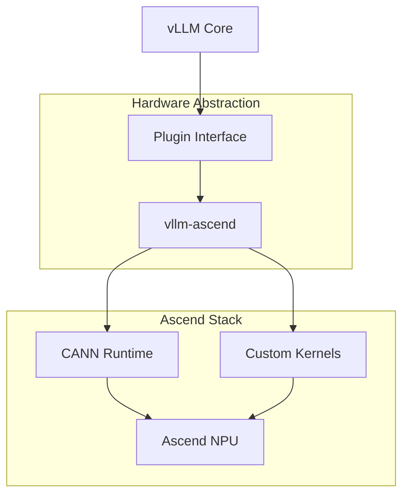

# vllm-ascend

Community-maintained vLLM hardware plugin for Ascend NPUs

## motivation

vLLM is a popular high-performance inference engine for large language models, but it was originally built for NVIDIA GPUs. As Ascend NPUs gain adoption in datacenters, especially in regions where they're cost-effective or preferred, there's a need to run vLLM workloads on this hardware without forking the entire codebase.

This plugin implements the hardware abstraction layer that vLLM expects, mapping operations to Ascend's CANN runtime and kernel libraries. The goal is to maintain compatibility with upstream vLLM while providing native Ascend acceleration.

## architecture



## getting started

### install

```bash
pip install vllm-ascend
```

Note: Requires CANN toolkit 7.0 or later to be installed on your system.

### quickstart

```python
from vllm import LLM, SamplingParams

# vLLM automatically detects and uses the Ascend plugin
llm = LLM(model="meta-llama/Llama-2-7b-hf", device="ascend")

prompts = [
    "The capital of France is",
    "The largest planet in our solar system is"
]

sampling_params = SamplingParams(temperature=0.8, top_p=0.95)
outputs = llm.generate(prompts, sampling_params)

for output in outputs:
    print(f"Prompt: {output.prompt}")
    print(f"Generated: {output.outputs[0].text}")
```

## how it works

The plugin implements vLLM's hardware backend interface, which requires providing memory management, kernel execution, and device synchronization primitives. When vLLM needs to allocate memory or run an operation, it calls the plugin's methods instead of directly invoking CUDA APIs.

Key components include:

- **Memory allocator**: Maps vLLM's allocation requests to CANN's memory pools
- **Attention kernels**: PagedAttention implementation using Ascend TBE or hand-written kernels
- **Model parallelism**: Adapts NCCL-based communication to HCCL (Huawei Collective Communication Library)
- **Quantization support**: INT8/INT4 operators using Ascend's AscendCL APIs

The plugin tries to reuse as much upstream vLLM code as possible. Python-level logic stays the same, only the hardware-specific primitives are replaced.

## configuration

Set the device in your vLLM initialization:

```python
llm = LLM(model="your-model", device="ascend")
```

Environment variables:

- `ASCEND_DEVICE_ID`: NPU device index (default: 0)
- `VLLM_ASCEND_KERNEL_PATH`: Custom kernel library path
- `VLLM_ASCEND_MEMORY_FRACTION`: Fraction of NPU memory to use (default: 0.9)

Configuration file `~/.vllm/ascend.json`:

```json
{
  "enable_custom_kernels": true,
  "kernel_optimization_level": 2,
  "max_num_batched_tokens": 8192,
  "graph_capture_enabled": false
}
```

## faq

**Q: Which Ascend NPU models are supported?**  
A: Ascend 910B and 910A are tested. 310P series may work for smaller models but is not officially supported.

**Q: Does this support all vLLM features?**  
A: Most core features work. Prefix caching and speculative decoding are experimental. LoRA adapters are not yet supported.

**Q: How does performance compare to NVIDIA GPUs?**  
A: Depends on the model and NPU generation. For Llama-2-7B, expect 70-85% of A100 throughput on 910B. Memory bandwidth bound operations are closer to parity.

**Q: Can I run multi-node distributed inference?**  
A: Yes, tensor parallelism and pipeline parallelism work across NPUs connected via HCCS or RoCE.

**Q: Where do I report issues?**  
A: GitHub issues on this repository. Include your CANN version, model, and error logs.

## license

Apache 2.0
